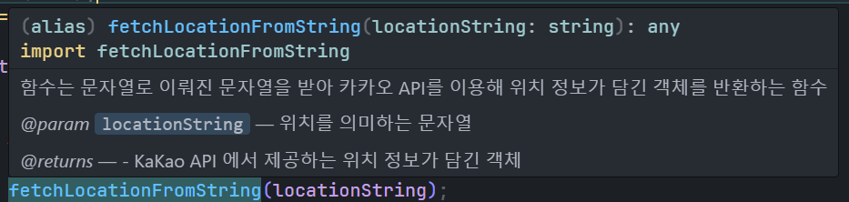

# `TypeScript` 를 시작하자

타입스크립트와 리액트 중 어떤 것을 먼저 공부할까 고민하다가

리액트를 먼저 배우고 현재 토이프로젝트를 진행하던 중

타입스크립트의 필요성을 느껴 타입스크립트 공부와 토이프로젝트를 동시에 진행해보려고 한다.

가장 크게 타입스크립트의 필요성을 느낀 이유는 다음과 같다.

`API` 를 패칭해오는 커스텀 훅을 만들던 중

```jsx
const useWeather = () => {
  ...
  const fetchWeather = async (locationString) => {
    try {
      setisLoading(true);
      // ! isLoading 상태를 보여주기 위한 delay 함수
      delay(DELAYTIME);
      const locationObject = await fetchLocationFromString(locationString);
      const forecastWeater = await fetchForecastFromLocation(locationObject);
...
```

서울특별시 도봉구 도봉동과 같은 `locationString` 을 문자로 받아 위경도가 담긴 객체를 패칭해오는`fetchLocationFromString` 함수와

`fetchLocationFromString` 의 결과값인 `locationObject` 를 인수로 받아 일기예보 정보가 담긴 객체를 패칭해오는 `fetchForecastFromLocation` 함수를 보던 중

함수명들이 매우 끔찍하게도 길어 코드가 지저분해보였다.

**난 왜 함수명을 이렇게 길게 지었지 ?**

난 함수명만 보더라도 해당 함수가 어떤 역할을 하는지를 명확히 하고 싶었다.

함수명을 짧게 하기 위해 `fetchLocation` 함수 명을 쓴다고 한다면 `fetchLocation` 함수가 어떤 값을 인수로 받아서 어떤 결과값을 반환하는지 파악하기가 쉽지 않을 것이다.

그러기에 함수명만으로 어떤 역할을 하는지 명확히 표현하기 위해 저렇게 길게 하였다.

**함수명을 짧게 하기 위해 한 나의 노력들**

그래서 처음에는 `JSDOCs` 를 이용해서 함수에 인수와 반환값의 타입을 적으려 했었다.

```jsx
/**
 * 함수는 문자열로 이뤄진 문자열을 받아 카카오 API를 이용해 위치 정보가 담긴 객체를 반환하는 함수
 * @param {String} locationString - 위치를 의미하는 문자열
 * @returns {Object} - KaKao API 에서 제공하는 위치 정보가 담긴 객체
 */
const fetchLocationFromString = async (locationString) => {
  const { APIKEY, URI } = KaKaoAPI;
  ...
```

다만 `JSDOCS` 를 이용해 함수를 정의한다 하더라도 함수를 호출 할 떄 잠깐 뜰 뿐

코드의 내역에선 보이지 않는다는 문제가 있었다.



이렇게 마우스를 올리거나, 함수를 호출할 때만 뜰 뿐 코드 자체에서 보이지는 않는다.

만약 내가 타입스크립트를 할줄 알았더라면

```jsx
type LocationObject = {
  // LocationObject의 구조를 정의
};

const fetchLocation = async (locationString : string) : Promise<LocationObject> => {
  const { APIKEY, URI } = KaKaoAPI;
```

처럼 함수를 정의 할 때 부터 타입을 정의하고 예기치 못한 인수가 들어올 때 컴파일 시 오류를 내거나

```jsx
const useWeather = () => {
  ...
  const fetchWeather = async (locationString : string) => {
    try {
      setisLoading(true);
      // ! isLoading 상태를 보여주기 위한 delay 함수
      delay(DELAYTIME);
      const locationObject = await fetchLocation(locationString);
      const forecastWeater = await fetchForecast(locationObject);
...
```

함수를 정의 할 때 각 타입들을 명시함으로서 함수의 실행 흐름을 명확히 할 수 있을 것 같았다.

또 가장 매력을 느낀점은 내가 사용하는 객체들의 타입을 커스텀하여 정의함으로서

내 코드들의 흐름을 파악하기 쉬울 것 같다는 생각이 들어 타입스크립트 공부를 시작하기로 하였다.

# 타입스크립트의 장점

- 오류 감소 : 타입스크립트는 자바스크립트의 슈퍼셋 언어로 개발 시 타입스크립트로 개발하여 실행 전 컴파일 한 후 자바스크립트로 실행한다. 이 때 컴파일 시 예기치 못한 타입으로 인한 오류를 컴파일 시 감지하여 런타임 시 발생 할 수 있는 오류를 방지 할 수 있다.
- 코드 가독성 및 유지 보수성 : 타입을 명시적으로 선언함으로서 코드의 실행 흐름을 명확히 한다.
- 안정성과 미래 준비성 : 위 두가지 이유로 인해 애플리케이션의 안정성을 높여주고 프로젝트 규모가 커졌을 때 발생 할 수 있는 많은 문제를 예방 할 수 있다.

사실 그리고 가장 큰 이유는
많은 곳들에서 쓰니까 .. 많은 사람들이 쓰니까 .. 나 혼자 `JSDOCS` 로 하는게 더 편하지 않나유 ? 하는 것보다 나도 배워서 같이 협업해야 하니까 .. 이런 이유도 없지않아 있긴 하다.
