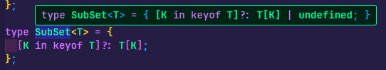

# 타입 조합

## 제네릭 ⭐

다른 타입들을 더 살펴보기 전, 제네릭 타입을 먼저 살펴보고 넘어가도록 하자

제네릭 타입이란 `Generic` 이란 단어에서도 알 수 있듯이

**일반적으로 정의된 타입** 을 의미한다.

제네릭은 생성 될 수 있는 다양한 타입들을 **타입 변수** 를 이용해 정의해두고

제네릭 타입을 활용하여 다른 타입들을 생성을 가능하게 한다.

이는 제네릭 타입에 대한 사전적 정의에 가깝고

제네릭 타입의 활용 용도에 근거하여 이야기 한다면

사전에 미리 선언해둬야 할 타입들을 , 타입 변수 형태로 생성해두고 컴파일 시 타입을 주입하는 타입을 의미한다.

밑의 예시를 살펴보자

```tsx
type ArrayTypes<T> = T[]; // T는 타입 변수 , 사전에 정의해야 할 타입을 타입 변수로 정의

const numberArr: ArrayTypes<number> = [1, 2, 3, 4, 5]; // 타입 선언 시 타입 주입
const stringArr: ArrayTypes<string> = ['a', 'b'];
```

`ArrayTypes` 라는 제네릭 타입을 살펴보면 `T` 라는 타입 변수를

타입 명과, 타입 값에 활용한 모습을 볼 수 있다.

> 타입 변수 명은 꼭 `T` 일 필요는 없다.
> 하지만 일반적으로
>
> - T : Type
> - E : Element
> - K : Key
> - V : Value
>   와 같이 다양한 변수들을 한글자로 축약해 약속적으로 사용한다.

### 제네릭의 타입 변수와 `any` 의 차이점

제네릭의 타입 변수에는 어떤 타입도 들어올 수 있다는 점에서 `any` 타입과 비슷하게 느껴지지만

둘은 활용되는 방식이 다르다.

우선적으로 `any` 타입을 통해 살펴보자

```ts
type anyArrayType = any[];

const exampleArr: anyArrayType = [1, 'a', true];
```

다음과 같이 `any` 로 다양한 타입들을 받을 수 있는 경우엔 해당 타입으로 선언된 객체는

내부에 다양한 타입의 값들을 받는 것이 가능하다. `[]` 내부 값들의 타입을 `any` 로 해뒀기 때문이다.

```typescript
type Generic<T> = T[];

const exampleArr: Generic<number> = [1, 'a', true];
```

하지만 제네릭 타입으로 선언되어 `<>` 내부에 `nubmer` 라는 타입을 넣어 타입 선언된 객체 내부에는 `<>` 내부에 존재하는 , 즉 타입 변수에 할당된 타입 외의 값 이외엔 넣지 못한다.

제네릭 타입은 타입을 일반적으로 선언해둘 수 있다는 점에서

함수에서 자주 사용된다.

함수는 다양한 타입의 인수들을 받을 수 있기 때문에 함수를 선언 할 때 모든 타입을 선언해두기 보다

제네릭 타입을 이용해 선언해주면 타입 선언 코드를 좀 더 간략하게 사용 할 수 있다.

```typescript
function Print(arg: Object | string | number | boolean): void {
  console.log(arg);
}
```

이처럼 함수 내에서 사용 할 매개 변수의 타입들을 모두 선언해주는 것 보다

```ts
function Print<T>(arg: T) {
  console.log(arg);
}
```

제네릭 타입으로 선언해주는 것이 더 간편하다.

좀 더 일반적인 경우를 생각해보자

```ts
function getLength(arg: number[]): number {
  return arg.length;
}

const numArr: number[] = [1, 2, 3];
```

다음과 같이 어떤 배열의 `length` 를 반환하는 함수가 존재한다 할 때

이번엔 `getLength` 에 들어갈 배열 내의 값들은 모두 `number` 타입 외에도 다양한 타입으로 이뤄진 배열들도 존재 할 수 있다.

```ts
function getLength(arg: number[]): number {
  return arg.length;
}

const numArr: number[] = [1, 2, 3];
const strArr: string[] = ['a', 'b', 'c'];
const boolArr: boolean[] = [true, true, false];

console.log(getLength(strArr)); // 컴파일 에러 발생
```

이에 만약 이처럼 `number[]` 타입이 아닌 다른 인수를 넣으면 컴파일 에러가 발생한다.

그렇다면 `getLength` 에서 다양한 배열을 받을 수 있도록 수정하기 위해선

```ts
function getLength(arg: number[] | string[] | boolean[]): number {
  return arg.length;
}

const numArr: number[] = [1, 2, 3];
const strArr: string[] = ['a', 'b', 'c'];
const boolArr: boolean[] = [true, true, false];

console.log(getLength(numArr));
console.log(getLength(strArr));
console.log(getLength(boolArr));
```

다음처럼 `arg` 에 들어올 수 있는 모든 타입을 미리 선언해줘야 한다.

하지만 제네릭 변수를 이용해준다면 ?

```ts
function getLength<T>(arg: T): number {
  return arg.length;
}

const numArr: number[] = [1, 2, 3];
const strArr: string[] = ['a', 'b', 'c'];
const boolArr: boolean[] = [true, true, false];

console.log(getLength(numArr));
console.log(getLength(strArr));
console.log(getLength(boolArr));
```

다음처럼 일반적으로 정의하여 사용 할 수 있다.

### 제네릭 타입 변수의 다양한 사용법

#### 제네릭 타입의 제약 `extends`

`TS` 의 `exnteds` 는 `JS` 내에서 클래스 상속을 위해 사용하는 `extends` 와 같은 이름이며

`extends` 는 인터페이스 타입과 제네릭 타입에서 사용 예시가 다른데

우선 현재 예시에선 **제네릭 타입** 에서의 `extends` 를 먼저 알아보자

**제네릭 타입에서의 `extends` 는 해당 타입 변수가 `extends` 이후에 존재하는 타입의 하위 타입이여야 한다는 상한선 `upper bound` 를 제한한다.**

```ts
function getLength<T>(arg: T): number {
  return arg.length;
}

const numArr: number[] = [1, 2, 3];

getLength(numArr);
```

사실 위에서 예시로던 들었던 함수는 컴파일 시 에러가 발생한다.

그 이유는 `T` 타입에 `length` 라는 프로퍼티가 존재하지 않을 수 있기 때문이다.

그렇다면 우린 타입변수 `T` 의 기본 조건이 필요하다.

타입 변수`T`는 `{length : number}` 라는 타입의 하위 타입이여야 한다.

> 하위 타입이란 `{length : number}` 타입을 갖는 타입이거나 해당 타입이 확장된 형태의 타입을 의미한다.

```ts
function getLength<T extends { length: number }>(arg: T): number {
  return arg.length;
}

const numArr: number[] = [1, 2, 3];
console.log(getLength(numArr));
```

이에 타입 변수 `T` 를 선언 할 때 `extends` 를 이용해 타입 변수 `T` 가 가져야 할 기본 조건을 정의해줌으로서 타입의 기본 조건을 만족시켜줄 수 있다.

#### 제네릭을 이용한 호출 시그니처 (`Call Signature`)

```js
const sum = (x: number, y: number): number => x + y;
```

다음과 같이 `sum` 변수에 함수를 할당하는 형태를 살펴보자

이 때 선언 할 함수의 타입을 `type , interface` 형태로 선언해둔 후

선언해둔 타입의 별칭을 변수에 할당해주는 방식을 인터페이스를 이용한 호출 시그니처라고 한다.

```jsx
// 사전에 사용 할 타입을 `interface` 형태로 생성
interface SumFunction {
  (x: number, y: number): number;
}
// 함수를 선언 할 때 생성해둔 인터페이스를 타입에 선언

const sum: SumFunction = (x, y) => x + y;
```

그럼 만약 `SumFunction` 에서 인수와 반환값의 타입이 `number` 뿐이 아니라 `string` 을 더해주고 싶다면 어떻게 해야 할까 ?

만약 인터페이스를 이용한 호출 시그니처를 이용 할 것이라면

```jsx
interface SumFunction2 {
  (x: string, y: string): string;
}
```

다음과 같이 다른 인터페이스를 선언해줘야 했겠지만

제네릭을 이용하면

호출 시그니처를 호출 할 때 내부에서 사용할 타입을 지정해주는 것이 가능하다.

```jsx
interface SumFunction<T> {
  (x: T, y: T): T;
}

const sumNumber: SumFunction<number> = (x, y) => x + y;
const sumString: SumFunction<string> = (x, y) => x + y;
```

위의 `SumFunction interface` 는 익명 함수에 대한 매개변수와 반환값의 타입을 지정해주는 호출 시그니처라면

내부 프로퍼티의 명까지 지정하는 호출 시그니처는 다음과 같이 생겼다.

```jsx
interface Calculator<T> {
  sum: (x: T, y: T) => T;
}

const numberCalcul: Calculator<number> = { sum: (x, y) => x + y };
const stringCalcul: Calculator<string> = { sum: (x, y) => x + y };

console.log(numberCalcul.sum(1, 2));
console.log(stringCalcul.sum('1', '2'));
```

중요한 점은 호출 시그니처에 정의된 제네릭 타입이 타입을 호출 할 때 타입 변수에 주입한 타입을 받아 생성된다는 것이다.

#### 제네릭 타입 기본 설정

함수를 선언 할 때 매개변수의 기본 값을 설정하듯 제네릭 타입 변수의 기본 값을 설정하는 것도 가능하다.

```tsx
interface Calculator<T = number> {
  sum: (x: T, y: T) => T;
}

const numberCalcul: Calculator = { sum: (x, y) => x + y };
const stringCalcul: Calculator<string> = { sum: (x, y) => x + y };

console.log(numberCalcul.sum(1, 2));
console.log(stringCalcul.sum('1', '2'));
```

## 교차 타입 (`intersection`)

교차타입은 `&` 을 이용해 표기한다 .

결과물로 탄생한 단일 타입에는 타입 별칭 (`type alias`)을 붙일 수 있다.

예를 들어 타입 C가 타입 A & B 라면 C 는 A , B 의 모든 타입을 가지고 있는 타입이다.

```jsx
type A = {
  name: string,
};

type B = {
  age: number,
};

type C = A & B;

const Account: C = {
  name: 'lee',
  age: 20,
};

console.log(Account);
```

## 유니온 타입 (`Union`)

유니온 타입은 타입 A , B 중 하나가 될 수 있는 타입을 말하며

`A|B` 처럼 표기한다.

```jsx
type A = {
  name: string,
};

type B = {
  age: number,
};

type C = A | B;

const Account: C = {
  name: 'lee',
};
```

타입 `C` 는 `A|B` 타입이기 때문에 조건적으로 `A` 혹은 `B` 의 타입을 가질 수 있다.

이는 두 타입 중 하나의 타입을 명확하게 갖는 것도 가능하며

```jsx
type A = {
  name: string,
};

type B = {
  age: number,
  address: string,
};

type C = A | B;

const Account: C = {
  name: 'lee', // A 의 타입
  address: 'seoul', // B 의 타입
};
```

다음 예시처럼 A , B 타입의 구조 중 일부만 갖는 것도 가능하다.

이처럼 유니온 타입은 타입의 유연성을 추가해주지만 이러한 유연성은

타입스크립트의 타입 선언시 혼란을 주기도 한다.

```jsx
type A = {
  name: string,
};

type B = {
  age: number,
  address: string,
};

type Account = A | B;

const printAccount = (account: Account) => {
  // Account 형식에 name 속성이 없습니다. B 형식에 name 속성이 없습니다.
  console.log(account.name);
  // Account 형식에 age 속성이 없습니다. A 형식에 Age 속성이 없습니다.
  console.log(account.age);
};
```

다음과 같은 예시에서 `printAccount`함수는 `Account` 타입의 인수를 받기를 기대하고 있다.

이후 함수 본문 내에서 `Account` 타입의 `name` 프로퍼티를 로그하는데 `Account` 타입은 `name , age` 속성을

가질 수도, 가지지 않을 수도 있다.

이에 컴파일러는 이러한 유연성으로 인해 발생 할 수 있는 문제를 방지하기 위해 컴파일 시 오류를 발생 시킨다.

다음과 같은 경우를 해결해주기 위해선 유니온 타입으로 선언하기 보다 명시적으로 해당 타입을 선언해줘야 한다.

```jsx
const printAccount = (account: { name: string, age: number }) => {
  // Account 형식에 name 속성이 없습니다. B 형식에 name 속성이 없습니다.
  console.log(account.name);
  console.log(account.age);
};

printAccount({ name: 'lee', age: 20 });
```

## 인덱스 시그니처

인덱스 시그니처는 타입의 프로퍼티명들은 알 수 없지만, 프로퍼티들의 타입을 미리 지정 하거나, 일괄적으로 지정 할 때 사용 할 수 있다.

```jsx
type User = {
  [key: string]: string,
};

const user1: User = {
  name: 'lee',
  address: 'seoul',
};
```

`User` 라는 타입을 선언 할 때 `[key : string] : type value` 형태로 선언해주었다.

이를 통해 `User` 타입의 내부 프로퍼티 명들이 어떤 것인지 미리 정하지 않더라도

해당 타입의 객체 내부 타입들을 일괄적으로 선언하는 것이 가능하다.

> 이 때 `[key : type value] : tyep value` 로 선언 할 때 `[]` 내부의 프로퍼티 명은 `key` 가 아니라 어떤 것을 사용해도 상관 없다.

만약 인덱스 시그니처로 선언되지 않은 타입이 프로퍼티 명으로 들엉오면 컴파일 시 오류가 발생한다.

```jsx
const user1: User = {
  name: 'lee',
  address: 'seoul',
  age: 20, // number 형식은 string 형식에 할당 할 수 없습니다.
};
```

만약 위 같이 `User` 타입의 객체 내에서 `stirng` 혹은 `number` 타입을 사용하고 싶다면

인덱스 시그니처를 표기 할 때 유니온 타입을 이용해주면 된다.

```jsx
type User = {
  [key: string]: string | number, // 유니온 타입으로 생성
};

const user1: User = {
  name: 'lee',
  address: 'seoul',
  age: 20,
};
```

## 인덱스 엑세스 타입

인덱스 엑세스 타입은 타입을 인덱스로 조회하기 위해 사용되는 타입이다.

```jsx
type User = {
  name: string,
  age: number,
  isVip: boolean,
};
```

다음과 같은 `User` 타입이 존재 할 때 `User` 타입을

마치 자바스크립트 객체에 접근하듯 인덱스로 조회하는 것이 가능하다.

```jsx
type User = {
  name: string,
  age: number,
  isVip: boolean,
};

type userName = User['name']; // stirng
```

이처럼 타입의 인덱스에 사용되는 `name` 자체도 하나의 타입이기 때문에 타입 명을 입력하여 조회하는 것이 가능하며

```jsx
type nameOrAge = User['name' | 'age']; // string | number
```

```jsx
type User = {
  name: string;
  age: number;
  isVip: boolean;
};

type UserTypeKey = keyof User; // name , age , isVip;
type UserTypes = User[UserTypeKey]; // string|number|boolean

const userName: UserTypes = 'lee';
```

혹은 타입 조합 형태로 조회하는 것도 가능하다.

이번엔 제네릭 타입을 이용하여 타입의 인덱스에 접근하는 경우를 살펴보자

```tsx
const ProductList = [
  { type: 'fruit', name: 'orange' },
  { type: 'vegetable', name: 'cucumber' },
];
```

## 맵드 타입

배열에서의 `map` 함수는 배열을 이용해 새로운 배열을 만드는 메소드이다.

```js
const arr = [1, 2, 3, 4, 5];

const newArr = arr.map((num) => num * 2);
```

이런식으로 말이다.

타입에서도 `map` 을 사용하는 것이 가능하다.

```tsx
type Example = {
  a: string;
  b: number;
  c: boolean;
};

type SubSet<T> = {
  [K in keyof T]?: T[K];
};

const aExample: SubSet<Example> = { a: 'ABCD' };
const bExample: SubSet<Example> = { b: 123 };
const cExample: SubSet<Example> = { c: true };
```

제네릭 타입인 `Subset<T>` 를 살펴보면 인덱스 시그니처 기법을 이용해 객체 내에서 가질 수 있는 타입들을 `T` 타입 내부에 존재하는 타입으로 재생성한다.

> `?:` 는 해당 타입이 존재 할 수도 있고 존재하지 않을 수도 있게 하는 것이다. 이는 마치 `K : T[K] | undefined` 와 같다.
> 

이러한 맵드 타입은 주로 타입을 재사용 할 떄 자주 사용된다.

