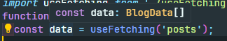
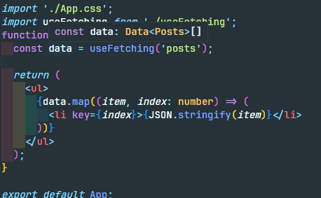
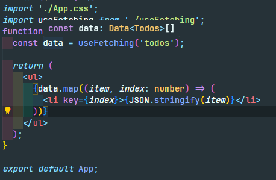

우아한 타입스크립트의 5장 타입 활용하기를 보다가 예시가 너무 어려워

개념만 비슷하게 하여 이해하기 쉽게 작성해봤다.

# 조건부 타입

조건부 타입이란 다음과 같이 작성한다.

```tsx
TypeA extends TypeB ? TypeC : TypeD
```

자바스크립트의 삼항 연산자를 이용해 작성하는데

자바스크립트와의 차이점은

자바스크립트에선 삼항 연산자의 좌항이 `true / false` 로 값이 결정되는 조건이였다면

타입스크립트에선 `TypeA` 가 `TypeB` 를 만족한다면 `TypeC` , 만족하지 않는다면 `TypeD` 라는 것을 의미한다.

> 타입을 만족한다는 것은 `TypeA` 가 `TypeB` 와 같거나 하위타입인지를 묻는 것이다.
> 타입스크립트는 구조적 타입 할당을 따르기 때문에 `TypeB` 가 갖고 있는 타입만을 갖고 있다면 `TypeA` 는 `TypeB` 를 만족한다.

# `extends` 와 제네릭을 활용한 조건부입타입

조건에 따라 다른 타입을 할당한다는 개념은

타입을 사용 할 때 동적으로 결정되는 제네릭 타입과 조합이 좋다.

```tsx
type SomeType<T extends number | string> = T extends number
  ? Money
  : Typography;
```

위 예시처럼 `someType` 의 타입을 제네릭 타입으로 정의 할 때

`<T extends A | B>` 와 같은 형태로 제네릭 타입인 `T` 가 가질 수 있는 타입 스코프를 제한해줄 수 있다.

`T extends number ? Money : Typography` 는 **제네릭 타입의 타입 값에 따라 조건부적으로 다른 타입의 값을 결정 하겠다는 의미를 갖는다.**

타입의 값을 결정하는 행위는 , 코드에서 가질 수 있는 타입의 값들을 엄격하게 제어함으로서

코드의 흐름을 개발자가 원하는 방향으로 가져가기 위해 중요하다.

타입 값을 결정하지 않는 방식과 조건부 타입을 통해 타입 값을 결정하는 방식 , 두 가지 예시를 통해 이해해보자

### 유니온 타입을 이용하여 타입 값을 결정하지 않는 방식

`API` 호출을 연습하기 위해 `jsonplaceholder` 사이트를 이용해보자

`URI` 가 다음과 같을 때 (`https://jsonplaceholder.typicode.com/`)

`path`가 `todo` 일 때와 `posts` 일 때 응답 받는 객체의 타입이 다르다.

```json
// /todos 일 때의 응답값
{
    "userId": 1,
    "id": 1,
    "title": "delectus aut autem",
    "completed": false
  },
  // /posts 일 때 응답 값
    {
    "userId": 1,
    "id": 1,
    "title": "sunt aut facere repellat provident ..",
    "body": "quia et suscipit nsuscipit  ...
  },
```

응답값을 받을 수 있는 타입들을 정의해주자

```typescript
type BaseData = {
  userId: number;
  id: number;
  title: string;
};

type Todos = {
  completed: boolean;
};

type Posts = {
  body: string;
};

type Data<T> = T & BaseData;

type BlogData = Data<Todos> | Data<Posts>;
```

제네릭타입을 통해 `Data<T>` 로 받을 수 있는 응답값의 타입을 정의해주고

`API` 를 보내 응답 받을 수 있는 값들을 유니온 타입으로 `BlogData` 타입에 정의해주자

```tsx
import { useEffect, useState } from 'react';
import type { BlogData } from './types';

const useFetching = (path: 'todos' | 'posts'): BlogData[] => {
  const [data, setData] = useState<BlogData[]>([]);

  const fetchData = async () => {
    const url = `https://jsonplaceholder.typicode.com/${path}`;
    const response = await fetch(url);
    const body: BlogData[] = await response.json();
    setData(body);
  };

  useEffect(() => {
    fetchData();
  }, [path]);

  return data;
};

export default useFetching;
```

이후 해당 훅을 살펴보자

`useFetching` 훅의 파라미터인 `path` 는 `todos | posts` 두 타입중 하나의 값을 가진다.

> 파라미터 값이 가질 수 있는 타입을 특정한 값의 조합으로 지정해줌으로서 파라미터로 들어오는 값을 제어해줄 수 있다.

`path` 값에 따라 다른 엔드포인트로 요청을 보내고 요청 받아오는 값들은 위에서 정의한 `BaseData` 타입이고

훅의 반환값의 타입은 `BaseData[]` 이다.



그럼 응답값은 `BaseData` 라는 타입으로 결정됐으니 끝난 것일까 ?

이는 타입이 결정된 것이라 볼 수 없다.

여전히 `BaseData` 는 `Data<Todos> | Data<Posts>` 인 유니온 타입이기 때문이다.

> ??? : ㅋㅋ 타입 내가 결정했는데 , 타입은 저 둘 중 하나야 ~~

### 제네릭 타입과 조건부 타입을 이용해 타입 값을 결정하는 방식

우리가 원하는 것은 `useFetching` 에 들어가는 매개변수 값에 따라

> 우리는 매개변수의 값을, 매개변수가 가질 수 있는 타입으로 정의했다.

응답 값의 타입을 결정하고 싶다.

그러면 응답 값의 타입인 `BlogData` 타입을 조건부 타입과 제네릭 타입을 통해 재정의해주자

```tsx
type BlogData<T extends 'todos' | 'posts'> = T extends 'todos'
  ? Data<Todos>
  : Data<Posts>;
```

`BlogData` 는 제네릭 타입 값인 `T` 값에 따라 `T` 가 `todos` 면 `Data<Todos>` 타입으로 , 아니면 `Data<Posts>` 타입으로 결정되도록 변경되었다.

```tsx
import { useEffect, useState } from 'react';
import type { BlogData } from './types';

const useFetching = <T extends 'todos' | 'posts'>(path: T): BlogData<T>[] => {
  const [data, setData] = useState<BlogData<T>[]>([]);

  const fetchData = async () => {
    const url = `https://jsonplaceholder.typicode.com/${path}`;
    const response = await fetch(url);
    const body: BlogData<T>[] = await response.json();
    setData(body);
  };

  useEffect(() => {
    fetchData();
  }, [path]);

  return data;
};

export default useFetching;
```

이후 `useFetching` 메소드에서 사용할 제네릭 타입 값 `T` 를 매개변수와 연결시켜주고

`BlogData` 타입의 제네릭 타입값으로 타입값을 주입 시켜주면

`useFetching` 메소드의 매개변수에 따라 응답값의 타입이 조건부적으로 결정되도록 변경되었다.





실제 매개변수 값에 따라 반환되는 값의 타입이 결정되는 모습을 볼 수 있다.

> 만일 `extends 'todos' | 'posts'` 외의 다른 값이 들어오면 타입스크립트 컴파일러는
> 오류를 발생시킨다.
