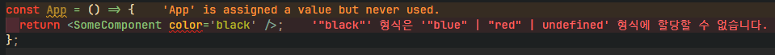

# `NonNullable` 타입가드 이용하여 `Null` 객체 타입 가드 하기

---

# `NonNullable<T>`

---

내용을 보기 전 먼저 타입스크립트의 유틸리티 타입인 `NonNullable<T>` 에 대해 알아보자

`NonNullable<T>` 유틸리티 타입은 `T` 에서 `undefined` 거나 `null` 인 타입을 제외한

`NonNullable` 한 타입을 반환한다.

```tsx
type t1 = string | null | undefined;
type t2 = NonNullable<t1>; // string
```

이를 통해 우리는 `NonNullable<T>` 을 이용해 `is` 연산자를 활용한 타입 가드를 생성해줄 수 있다.

예를 들어 다음과 같은 경우를 생각해보자

```tsx
const AdPage: React.FC<{ idList: number[] }> = ({ idList }) => {
  const [products, setProducts] = useState<Product[]>([]);
  useEffect(() => {
    const fetching = async (id: number): Promise<Product | null> => {
      try {
        const response = await fetch(`/shop/id=${id}`);
        return await response.json();
      } catch (e) {
        return null;
      }
    };

    Promise.all(idList.map((id) => fetching(id))).then((res) => {
      setProducts(res);
    }); // TypeError : res = (Product | null)[]
  }, [idList]);

  return (
    <div>
      {products.map((product: Product) => {
        return (
          <div key={product.id}>
            <h1>{product.name}</h1>
            <h2>{product.price}</h2>
          </div>
        );
      })}
    </div>
  );
};
```

해당 컴포넌트는 `useEffect` 내부에서 `fetching` 메소드를 이용해 데이터를 패칭해오며

`fetching` 메소드 반환값의 타입은 `Promise<Product|null>` 이다.

오류가 발생 할 경우엔 `null` 값을 반환하기로 했기 때문이다.

현재의 컴포넌트는 컴파일 에러가 발생하는데 `Promise.all` 이후 `then chaining` 과정 중

`setProducts(res)` 이후 변경될 `products` 의 타입이 `(Product | null)[]` 이기 때문에

반환 할 컴포넌트에서 `null` 객체의 프로퍼티에 접근하려 하게 될 수 있기 때문이다.

이 때 위에서 생성해준 타입 가드를 이용해주도록 하자

```tsx
function IsNonNullabel<T>(x: T): x is NonNullable<T> {
  return x !== null && x !== undefined;
}
```

```tsx
Promise.all(idList.map((id) => fetching(id)))
  .then((res) => {
    // res 의 타입은 (Product | null )[]
    return res.filter(IsNonNullabel);
  }) // 타입 가드를 통해 필터링 이후의 res의 타입을 좁혀주자
  .then((res) => setProducts(res)); // res의 타입은 Product[]
```

이렇게 타입 명제를 유틸리티 타입을 활용하여 타입 가드를 생성해줄 수 있다.

# 불변 객체 타입으로 활용하기

---

이전 게시글에서 문자열 리터럴 타입을 활용하여

해당 타입이 할당된 값에 다른 값이 들어오는 휴먼 에러를 방지 할 수 있다고 하였다.

이런 리터럴 타입을 활용하여 리액트 컴포넌트에 들어 갈 수 있는 `props` 에

약속된 값들만 넣어주는 것도 가능하다.

```tsx
type Props = {
  color: 'red' | 'blue';
};

const SomeComponent: React.FC<Props> = ({ color }) => {
  return (
    <div style={{ color }}>
      <p>나는야 컴포넌트라네</p>
    </div>
  );
};
```

다음과 같이 `SomeComponent` 의 `props` 에는 위에서 정의한 `Props` 의 타입만 들어 갈 수 있게 지정해주었다.

해당 타입의 `props` 를 받는 컴포넌트를 호출 할 때 다른 값의 `props` 를 집어넣게 되면

컴파일 오류가 발생한다.

```tsx
const App = () => {
  return <SomeComponent color='black' />;
};
```



이를 통해 문자열 리터럴 유형과 같은 **불변 객체 유형** 을 타입으로 할당해줌으로서

엄격한 타입 관리를 하여 타입 안정성을 강화하고 오류 위험성을 줄여줄 수 있다.

## `theme` 객체의 타입으로 타입 안정성 늘리기

사례를 통해 알아보자

우리의 웹 앱에서 `CSS` 속성은 `css is js` 를 이용하여 하기로 하고

모든 `CSS` 속성 값들은 `theme` 이라는 한 객체 내부에서 중앙 집중형으로 관리해주기로 했다고 해보자

```tsx
const theme = {
  color: {
    default: 'grey',
    red: '#F45452',
    blue: '#1A7CFF',
    green: '#0C952A',
  },
};

const SomeComponent = ({ color }) => {
  return <div style={{ color: theme.color }}></div>;
};

const App = () => {
  return <SomeComponent color='red' />; // 문제 없음
};

const App = () => {
  return <SomeComponent color='supa dupda diva' />; // TypeError 발생 시키고 싶음
};
```

여기서 우리는 모든 컴포넌트들의 `color props` 의 값이 `theme` 에 존재하는 키 값만 들어오도록 변경해주고 싶다.

```tsx
type Props = { color: keyof typeof theme.color };

const SomeComponent: React.FC<Props> = ({ color }) => {
  // color: "default" | "red" | "blue" | "green"
  return <div style={{ color }}></div>;
};
```

이 때는 불변 객체를 타입 객체로 변경한 후 해당 객체의 키 값만 들어올 수 있도록 변경해줌으로서

해당 불변 객체의 키 값만 가져오도록 수정해줄 수 있다.
